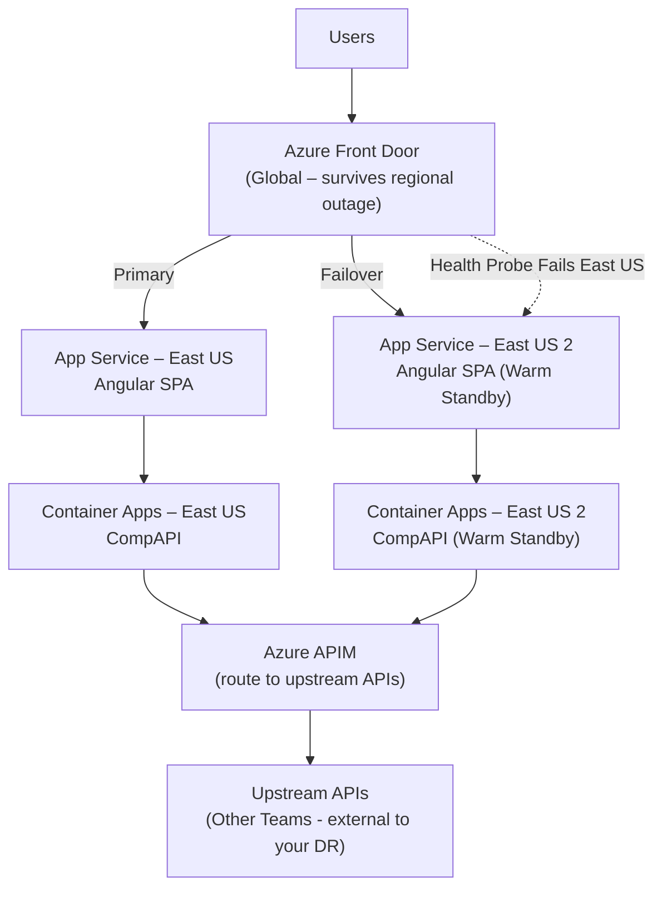
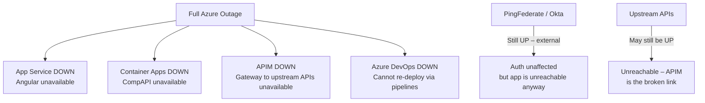

Here's the Mermaid code for that flowchart:

The dotted arrow (`-.->`) represents the health-probe failover path, matching the dashed line in your diagram. Paste it into mermaid.live (or any Mermaid renderer) and it'll render the same structure.

Same structure as the image: the outage node fans out to the four DOWN boxes, with PingFederate/Okta and Upstream APIs as separate standalone chains on the right.